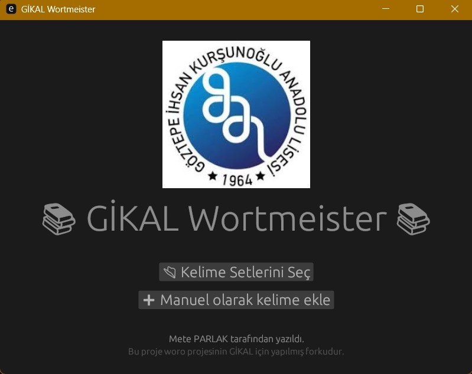

# ◣◢
- For more info: https://gentoo888.github.io/mevicta/wortmeister.html
- Learning journal: https://gentoo888.github.io/mevicta/ww.html
# 🇩🇪 GİKAL Wortmeister 🇩🇪

Almanca kelime öğrenme uygulaması - Rust + egui/eframe ile geliştirilmiştir.

## Özellikler

- 📖 Gömülü kelime setleri (Hazırlık, 9-10. sınıf)
- 🎮 İnteraktif oyun modu
- 📊 İlerleme takibi (seviye sistemi)
- 💾 Otomatik kaydetme
- 🖼️ Gömülü logo ve kaynaklar
- ➕ Manuel kelime ekleme (TXT import desteği)
- 🔄 Rastgele kelime seçimi

## Teknolojiler
- Rust - Programlama dili
- egui/eframe - GUI framework
- serde/serde_json - JSON parsing
- image - Görsel yönetimi
- rfd - Dosya dialog
## Geliştirici
Mete PARLAK

Bu proje woro projesinin GİKAL için fork'udur.

📄 Lisans
MIT License - İstediğiniz gibi kullanabilirsiniz!

## Katkıda Bulunma
Fork yapın
Feature branch oluşturun (git checkout -b feature/amazing)
Commit edin (git commit -m 'Add amazing feature')
Push edin (git push origin feature/amazing)
Pull Request açın
## Notlar
- Kelimeler compile-time'da binary'ye gömülüdür
- İlerleme user_progress.json dosyasına kaydedilir
- Seviye 5'e ulaşan kelimeler "ezberlendi" sayılır
⭐⭐ Beğendiyseniz yıldız vermeyi unutmayın! ⭐⭐
